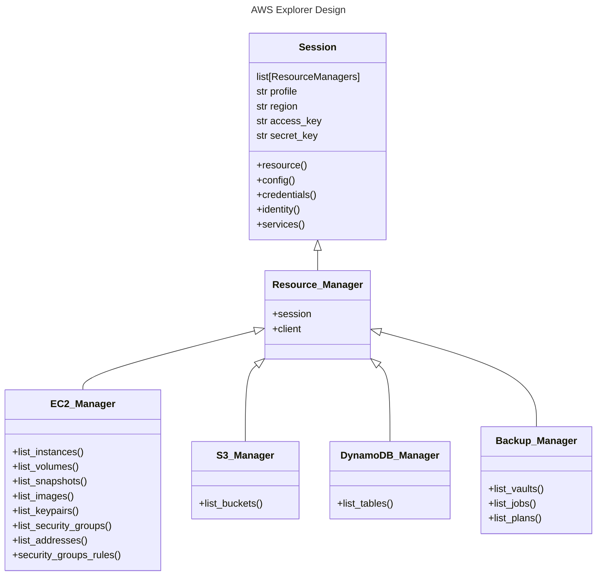

# Design

```mermaid

---
title: AWS Explorer Design 
---

classDiagram

    class Session{
        list[ResourceManagers]
        str profile
        str region
        str access_key
        str secret_key

        +resource()
        +config()
        +credentials()
        +identity()
        +services()
    }


    class Resource_Manager{
        +session
        +client
    }


    class S3_Manager{
        +list_buckets()
    }

    class DynamoDB_Manager{
        +list_tables()
    }

    class Backup_Manager{
        +list_vaults()
        +list_jobs()
        +list_plans()
    }

    class EC2_Manager{
        +list_instances()
        +list_volumes()
        +list_snapshots()
        +list_images()
        +list_keypairs()
        +list_security_groups()
        +list_addresses()
        +security_groups_rules()

        
    }

    Session <|-- Resource_Manager
    Resource_Manager <|-- EC2_Manager
    Resource_Manager <|-- S3_Manager
    Resource_Manager <|-- DynamoDB_Manager
    Resource_Manager <|-- Backup_Manager


    %% ---------------------------


```